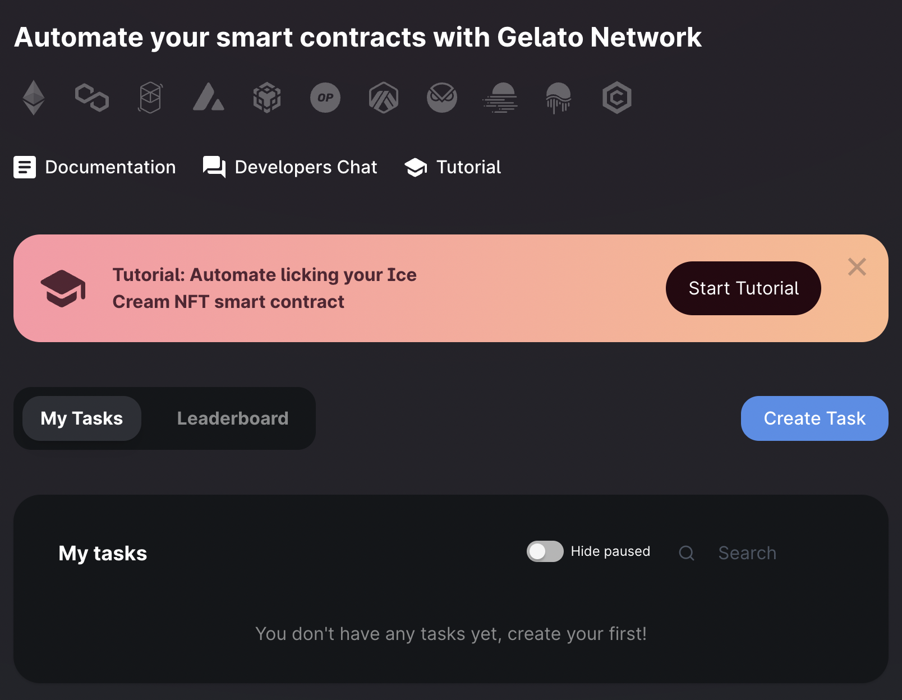
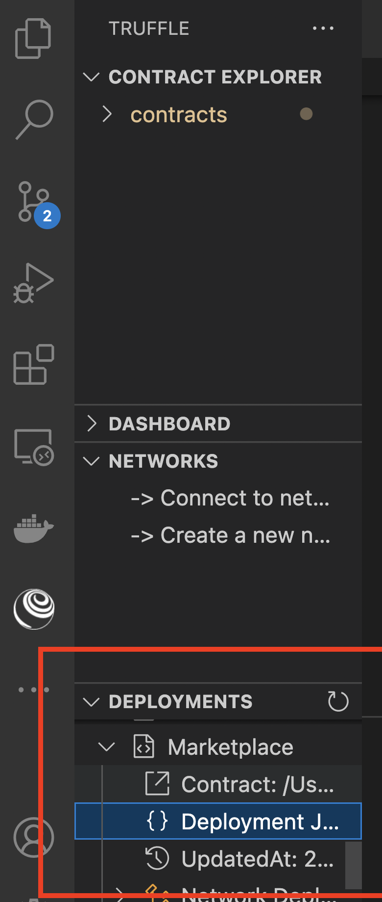
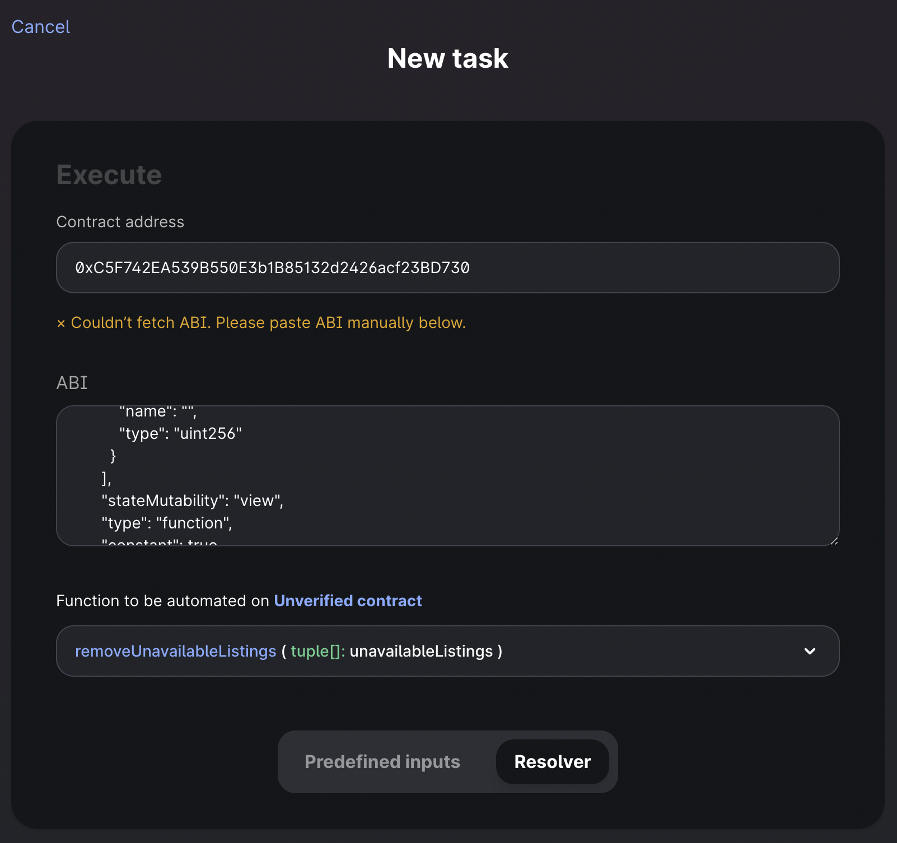
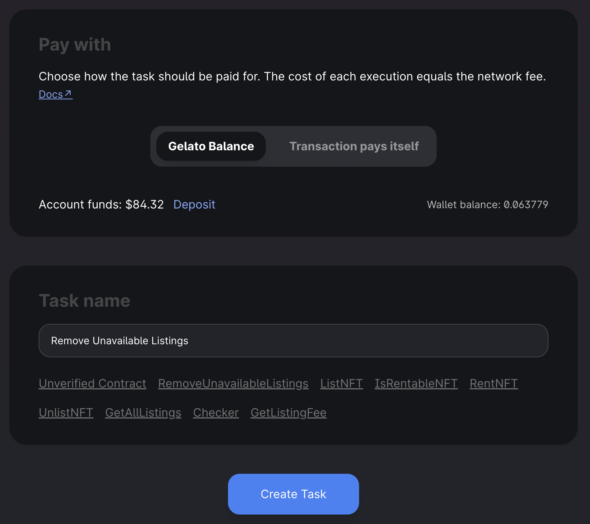
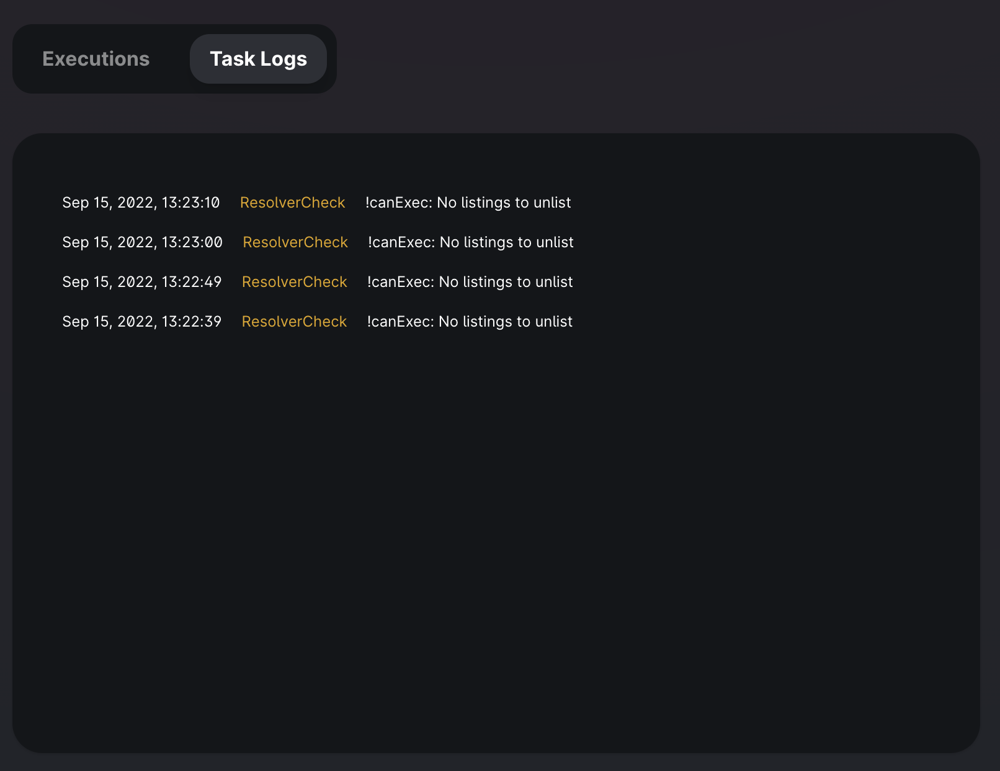
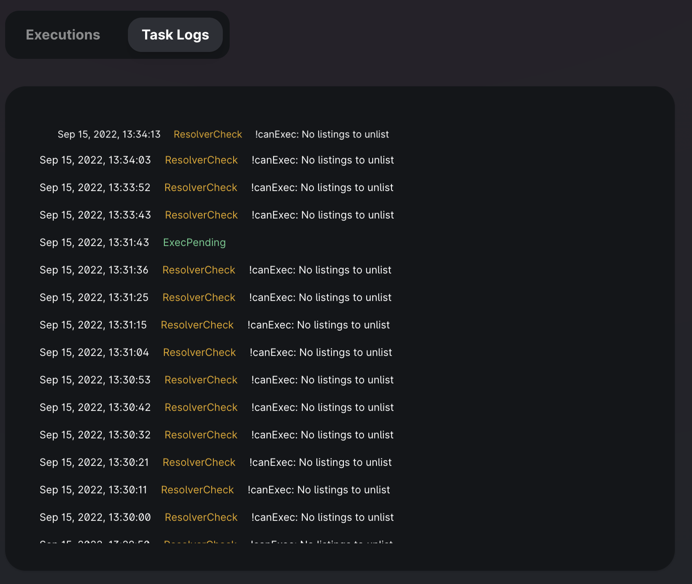

# Web3 Unleashed: How to Automate Your Smart Contracts

Written by [Emily Lin](https://twitter.com/_emjlin)

Last updated 9/15/2022

## Overview 

In this edition of Web3 Unleashed, we're interviewing Gelato Network co-founder Hilmar Orth about all things smart contract automation - what it is, how it's revolutionizing Web3 devOps, and how to do it!

<iframe width="560" height="315" src="https://www.youtube.com/embed/VxylZt7BsV4" title="YouTube video player" frameborder="0" allow="accelerometer; autoplay; clipboard-write; encrypted-media; gyroscope; picture-in-picture" allowfullscreen></iframe>

In this guide, we'll be building on our NFT rental marketplace [we built last week](https://trufflesuite.com/guides/nft-rental-marketplace/). Specifically, we'll demonstrate how to use Gelato Ops to automate cleaning up our listings - that is, periodically removing unavailable listings. Watch the stream to learn more about Gelato's other offerings, such as their [relay SDK](https://docs.gelato.network/developer-products/gelato-relay-sdk).

The completed code lives [here](https://github.com/trufflesuite/unleashed_nft_rental_marketplace/tree/gelato).

## What is Gelato?

[Gelato Network](https://www.gelato.network/) takes away the need for web3 developers to manually manage smart contract processes. Specifically, it leverages a network of decentralized bots to automate transactions, taking the onus off developers to maintain complex systems that could result in a central point of failure, allowing them to dedicate more time to what matters most: building out dapps across DeFi, NFTs, gaming, DAOs, and whatever else the future of Web3 holds!

## Using Gelato Ops

Gelato Ops is a nifty automation hub that allows users to create their automated tasks. Read more about it [here](https://docs.gelato.network/developer-products/gelato-ops-smart-contract-automation-hub/getting-started).

{: style="width:12rem"}

For our use case, our automated task relies on a dynamic argument `Listing[] listings` and will only be executed under the condition that there are listings that are no longer available to rent. Therefore, we need to write a [resolver](https://docs.gelato.network/developer-products/gelato-ops-smart-contract-automation-hub/guides/writing-a-resolver) to solve our more complex use case.

## Download System Requirements

You'll need to install:

- [Node.js](https://nodejs.org/en/), v12 or higher
- [truffle](https://trufflesuite.com/docs/truffle/getting-started/installation)

## Create an Infura account and project

To connect your DApp to the Goerli network, you'll need an Infura account. Sign up for an account [here](https://infura.io/register?utm_source=web3unleashed&utm_medium=webinar&utm_campaign=2022_Sep_gelato-smart-contract-automation_tutorial_content).

Once you're signed in, create a project! Let's call it `gelato-automation`, and select Web3 API from the dropdown

## Register for a MetaMask wallet

To interact with your DApp in the browser, you'll need a MetaMask wallet. You can download it and create one [here](https://metamask.io/download/?utm_source=web3unleashed&utm_medium=webinar&utm_campaign=2022_Sep_gelato-smart-contract-automation_tutorial_content).

## Download VS Code

Feel free to use whatever IDE you want, but we highly recommend using VS Code! You can run through most of this tutorial using the Truffle extension to create, build, and deploy your smart contracts, all without using the CLI! You can read more about it [here](https://trufflesuite.com/blog/build-on-web3-with-truffle-vs-code-extension/).

## Get Some Test Eth

In order to deploy to the public testnets, you'll need some test Eth to cover your gas fees! Make sure you're getting test Eth for either [Goerli](https://goerli-faucet.pk910.de/) or Sepolia.

## Set Up Your Project

Since we're building on our NFT rental marketplace from episode 4, start by cloning the base repository.

```shell
git clone https://github.com/trufflesuite/unleashed_nft_rental_marketplace.git gelato-demo
```

We'll only be working with contracts, so hop into the `truffle` directory and install our package dependencies.

```shell
cd gelato-demo/truffle
npm i
```

## Write the automated task

In our marketplace, we will remove listings that are no longer available. A listing becomes unavailable when the end date of the listing has passed. Add this method to `Marketplace.sol`: 

```javascript
function removeUnavailableListings(Listing[] memory unavailableListings) public {
    for (uint i = 0; i < unavailableListings.length; i++) {
        unlistNFT(unavailableListings[i].nftContract, unavailableListings[i].tokenId);
    }
}
```

It steps through a list of unavailable listings and calls our already written `unlistNFT` function, which will remove the NFT from our marketplace's list of listings and decrement the total number of listings available.

## Write `IResolver`

Because our automated task takes in the dynamic argument `unavailableListings` and is dependent on on a few conditions, we'll need to write a resolver. The first thing we will do is create a resolver interface. This isn't explicitly necessary, but is good practice if you have to write multiple resolvers for different smart contracts.

```shell
truffle create contract IResolver
```
Then, paste in the following code:

```javascript
// SPDX-License-Identifier: MIT
pragma solidity >=0.4.22 <0.9.0;

interface IResolver {
    function checker()
        external
        view
        returns (bool canExec, bytes memory execPayload);
}
```

And have `Marketplace.sol` extend that contract:

```javascript
import "./IResolver.sol";

contract Marketplace is ReentrancyGuard, IResolver {
```

## Write the resolver

Now, we can get to actually writing our resolver! It should return two things:

1. bool `canExec` : whether Gelato should execute the task.
2. bytes `execPayload` :  data that executors should use for the execution.

Add this method:

```javascript
function checker()
    external
    view 
    override
    returns (bool canExec, bytes memory execPayload)
{
    uint256 totalListingCount = _nftsListed.current();
    uint256 unavailableListingCount = 0;
    Listing[] memory allListings = getAllListings();
    for (uint i = 0; i < totalListingCount; i++) {
        if (allListings[i].endDateUNIX > block.timestamp) {
            unavailableListingCount++;
        }
    }

    if (unavailableListingCount <= 0) {
        return (false, bytes("No listings to unlist"));
    }
    if (tx.gasprice > 80 gwei) {
        return (false, bytes("Gas price is greater than 80 gwei"));
    }

    Listing[] memory unavailableListings = new Listing[](unavailableListingCount);
    uint256 unavailableListingsCount = 0;
    for (uint i = 0; i < totalListingCount; i++) {
        if (allListings[i].endDateUNIX > block.timestamp) {
            unavailableListings[unavailableListingsCount] = allListings[i];
            unavailableListingsCount++;
        }
    }

    execPayload = abi.encodeWithSelector(
        this.removeUnavailableListings.selector,
        unavailableListings
    );
    return (true, execPayload);
}
```

Now, let's dive into the code.

In order to construct our list of unavailable listings to pass into the automated task, we want to get the number of unavailable listings as follows:

```javascript
uint256 totalListingCount = _nftsListed.current();
uint256 unavailableListingCount = 0;
Listing[] memory allListings = getAllListings();
for (uint i = 0; i < totalListingCount; i++) {
    if (allListings[i].endDateUNIX > block.timestamp) {
        unavailableListingCount++;
    }
}
```

Next, since removing unavailable listings is contingent upon there being listings in the first place, we want to exit the resolver. In addition to returning `false` for `canExec`, we can also log the reason for the failure as follows:

```javascript
if (unavailableListingCount <= 0) {
    return (false, bytes("No listings to unlist"));
}
if (tx.gasprice > 80 gwei) {
    return (false, bytes("Gas price is greater than 80 gwei"));
}
```

Also, notice that we included a gas limit. Since what we are automating is not necessarily time-sensitive, we can add in that check so we don't incur higher costs. In our example, we will be running the checker with every block. If you want the task to only check at a certain cadence, you can add a `lastExecuted` like in the [docs](https://docs.gelato.network/developer-products/gelato-ops-smart-contract-automation-hub/guides/writing-a-resolver/smart-contract-resolver).

The last piece is actually constructing the list of unavailable listings and executing the automated task:

```javascript
Listing[] memory unavailableListings = new Listing[](unavailableListingCount);
uint256 unavailableListingsCount = 0;
for (uint i = 0; i < totalListingCount; i++) {
    if (allListings[i].endDateUNIX > block.timestamp) {
        unavailableListings[unavailableListingsCount] = allListings[i];
        unavailableListingsCount++;
    }
}

execPayload = abi.encodeWithSelector(
    this.removeUnavailableListings.selector,
    unavailableListings
);
return (true, execPayload);
```

To briefly explain `abi.encodeWithSelector`, the function selector is the first four bytes of Keccak-256 (SHA-3) hash of the function signature, which indicates the function to be called. This allows our automated task to be called with the appropriate parameters. So, we just end with returning `(true, execPayload)` to indicate what the task is and that it should be executed.

## Update `unlistNFT`

Currently, `unlistNFT` can only be called by the owner of NFT or the marketplace contract address. Now that gelato is automating that task, we need to whitelist its address as well. You can see the list of contract addresses [here](https://docs.gelato.network/developer-products/gelato-ops-smart-contract-automation-hub/contract-addresses). We'll be deploying on Goerli, so the address we will whitelist is `0xc1C6805B857Bef1f412519C4A842522431aFed39`. If you followed along in [Web3 Unleashed episode 3](https://trufflesuite.com/guides/upgrading-security/), you might remember learning about proxy contracts. In this case, the Gelato Ops contract is a proxy contract, so its address is constant despite its implementation contract potentially changing.

Anyways, add the constant to the `Marketplace.sol` list of variables at the top `address private constant GELATO_OPS_GOERLI = address(0xc1C6805B857Bef1f412519C4A842522431aFed39);`.

Then modify the `require` conditions to include the Ops contract address:

```javascript
require(listing.owner == msg.sender || _marketOwner == msg.sender || GELATO_OPS_GOERLI == msg.sender,
            "Not approved to unlist NFT");
```

Your final function should look like this:

```javascript
function unlistNFT(address nftContract, uint256 tokenId)
    public
    payable
    nonReentrant
{
    Listing storage listing = _listingMap[nftContract][tokenId];
    require(listing.owner != address(0), "This NFT is not listed");
    require(listing.owner == msg.sender || _marketOwner == msg.sender || GELATO_OPS_GOERLI == msg.sender,
        "Not approved to unlist NFT");
    // fee to be returned to user if unlisted before rental period is up
    // nothing to refund if no renter
    uint256 refund = 0;
    if (listing.user != address(0)) {
        refund = ((listing.expires - block.timestamp) / 60 / 60 / 24 + 1) * listing.pricePerDay;
        require(msg.value >= refund, "Not enough ether to cover refund");
        payable(listing.user).transfer(refund);
    }
    // clean up data
    IERC4907(nftContract).setUser(tokenId, address(0), 0);
    EnumerableSet.remove(_nftContractTokensMap[nftContract], tokenId);
    delete _listingMap[nftContract][tokenId];
    if (EnumerableSet.length(_nftContractTokensMap[nftContract]) == 0) {
        EnumerableSet.remove(_nftContracts, nftContract);
    }
    _nftsListed.decrement();

    emit NFTUnlisted(
        msg.sender,
        nftContract,
        tokenId,
        refund
    );
}
```

### Deploy the RentablePets contract to Goerli

First, let's deploy the `RentablePets` contract to Goerli. If you haven't already done so, clone the [`unleashed_rentable_nft` repo](https://github.com/trufflesuite/unleashed_rentable_nft). Then, let's deploy it to the Goerli testnet using Truffle dashboard! To do so, let's add our Infura Goerli endpoint to our MetaMask wallet. First get your Infura endpoint from your Infura dashboard, and then navigate to Add Networks in MetaMask.

{: style="width:12rem"}

{: style="width:12rem"}

Make sure your MetaMask wallet is connected to `goerlidev` and run:

```shell
truffle dashboard
truffle migrate --network dashboard
```

This should bring up Truffle dashboard on localhost:24012 and prompt you to sign the deployment. After that's been deployed, now let's verify it!

### Deploy the RentablePets contract to Goerli

Let's deploy the contract to Goerli. Then, let's deploy it to the Goerli testnet using Truffle dashboard! To do so, let's add our Infura Goerli endpoint to our MetaMask wallet. First get your Infura endpoint from your Infura dashboard, and then navigate to Add Networks in MetaMask.

{: style="width:12rem"}

{: style="width:12rem"}

Make sure your MetaMask wallet is connected to `goerlidev` and run:

```shell
truffle dashboard
truffle migrate --network dashboard
```

This should bring up Truffle dashboard on localhost:24012 and prompt you to sign the deployment.

## Add the task to Gelato Ops

Gelato has a super easy to use UI to automate your tasks. Navigate to the [app](https://app.gelato.network/) and hit create task! It's pretty simple

First, add your `Marketplace` contract address - because we didn't verify the contract, we'll have to manually add in the `abi`. To get this, go to `Marketplace.json` file in your `contracts_build_directory`. Alternatively, if you have the VS Code extension, you can directly access it there.

{: style="width:12rem"}

Open it up, and copy in the ABI into the Gelato app and choose `removeUnavailableListings` as the function of choice to automate.

{: style="width:12rem"}

Next, since we are using a resolver, choose `Resolver` and paste in the contract address and ABI, and then select `checker` as your resolver function. Note that Gelato will prompt you for a proxy contract. Since this is simple example, we don't need to check that off.

{: style="width:12rem"}

Lastly, we have two options to pay. Go ahead and choose Gelato balance, name your task `Remove Unavailable Listings`, and create the task!

{: style="width:12rem"}

## Test the Task

Let's go ahead and test the task. If we wait a bit without listing any NFTs, you'll notice that the resolver properly returns `false` and logs the appropriate message.

{: style="width:12rem"}

To test this out, let's mint and list an NFT. Go to the `run.js` script and comment out the `rent` and `unlist` function call so when we call the script, we only list it. Additionally, we'll want to edit the end date for listing so that we can quickly cause a task execution.

```javascript
const RentableNft = artifacts.require("RentableNft");
const Marketplace = artifacts.require("Marketplace");
const TODAY = Math.floor(Date.now()/1000) + (60*60);
const TOMORROW = TODAY + (24*60*60);
const TOKEN_ID = 1;
const PRICE = 1;
const START = TODAY;
const END = TODAY + 500;
const EXPIRES = TOMORROW;
const ERC721_ABI = [
  {
      "inputs": [{"internalType": "address", "name": "to", "type": "address"}, {
      "internalType": "uint256",
      "name": "tokenId",
      "type": "uint256"
      }], "name": "approve", "outputs": [], "stateMutability": "nonpayable", "type": "function"
  },
  {
      "inputs": [{"internalType": "uint256", "name": "tokenId", "type": "uint256"}],
      "name": "ownerOf",
      "outputs": [{"internalType": "address", "name": "owner", "type": "address"}],
      "stateMutability": "view",
      "type": "function"
  },
  {
    "inputs": [
      {
        "internalType": "uint256",
        "name": "tokenId",
        "type": "uint256"
      }
    ],
    "name": "userExpires",
    "outputs": [
      {
        "internalType": "uint256",
        "name": "",
        "type": "uint256"
      }
    ],
    "stateMutability": "view",
    "type": "function",
    "constant": true
  }
];
const main = async (cb) => {
    try {
        const nft = await RentableNft.deployed();
        const NFT_CONTRACT = nft.address;
        let txn = await nft.mint("test");
        console.log(txn);
        const marketplace = await Marketplace.deployed();
        const listingFee = (await marketplace.getListingFee()).toString();
        const nftContract = new web3.eth.Contract(ERC721_ABI, NFT_CONTRACT);
        const owner = await nftContract.methods.ownerOf(TOKEN_ID).call();
        txn = await nftContract.methods.approve(marketplace.address, TOKEN_ID).send({from: owner});
        console.log(txn);
        txn = await marketplace.listNFT(
            NFT_CONTRACT, TOKEN_ID, PRICE, START, END, {from: owner, value: listingFee});
        console.log(txn);
        let value = ((EXPIRES - TODAY)/60/60/24 + 1) * PRICE;
        let user = (await web3.eth.getAccounts())[0];
        // txn = await marketplace.rentNFT(NFT_CONTRACT, TOKEN_ID, EXPIRES, {from: user, value: value});
        // console.log(txn);
        // value = (Math.floor((EXPIRES - Date.now()/1000)/60/60/24 + 1)) * PRICE;
        // let options = value < 0 ? {from: owner} : {from: owner, value: value};
        // txn = await marketplace.unlistNFT(NFT_CONTRACT, TOKEN_ID, options);
        // console.log(txn);
    } catch(err) {
        console.log(err);
    }
    cb();
}
module.exports = main;``
```

Start the console by calling `truffle console --dashboard` and then call `run.js` using `exec run.js`. You'll need to sign 3 transactions: mint, approve, and list. If you don't want to do this manually through dashboard, you can opt to specify a `goerli` network in the `truffle-config` like [this](https://trufflesuite.com/docs/truffle/reference/configuration/).

You can quickly verify the NFT has been listed provided Gelato hasn't already executed your task as follows:

```shell
truffle(dashboard)> let mp = await Marketplace.deployed()
undefined
truffle(dashboard)> mp.getAllListings()
[
  [
    '0xA31618621805C9215B5Ade58EB09dBA8f32Bbdb8',
    '0x0000000000000000000000000000000000000000',
    '0xaa902bEc2FEa12bc2AD4F94D58CF7dF424e18f0d',
    '1',
    '1',
    '1663244950',
    '1663245450',
    '0',
    owner: '0xA31618621805C9215B5Ade58EB09dBA8f32Bbdb8',
    user: '0x0000000000000000000000000000000000000000',
    nftContract: '0xaa902bEc2FEa12bc2AD4F94D58CF7dF424e18f0d',
    tokenId: '1',
    pricePerDay: '1',
    startDateUNIX: '1663244950',
    endDateUNIX: '1663245450',
    expires: '0'
  ]
]
```

Now, we expect the resolver to pass true and execute the task. You can see it in the logs in your Gelato app:

{: style="width:12rem"}

And reverify that the listing is unlisted by calling `mp.getAllListings()`

```shell
truffle(dashboard)> mp.getAllListings()
[]
```

## Future Extensions

So, that's it! We've written a resolver and automated a task!

For a more a detailed walkthrough of the code, be sure to watch the livestream on [YouTube](https://youtu.be/VxylZt7BsV4). Next episode we'll be covering decentralized streaming with Livepeer.

Sign up for reminders for Web3 Unleashed [here](https://consensys-software.typeform.com/to/vECIYbiQ). If you want to talk about this content, make suggestions for what you'd like to see or ask questions about the series, start a discussion [here](https://github.com/orgs/trufflesuite/discussions/categories/web3-unleashed). If you want to show off what you built or just hang with the Unleashed community in general, join our [Discord](https://discord.com/invite/hYpHRjK)! Lastly, don't forget to follow us on [Twitter](https://twitter.com/trufflesuite) for the latest updates on all things Truffle.